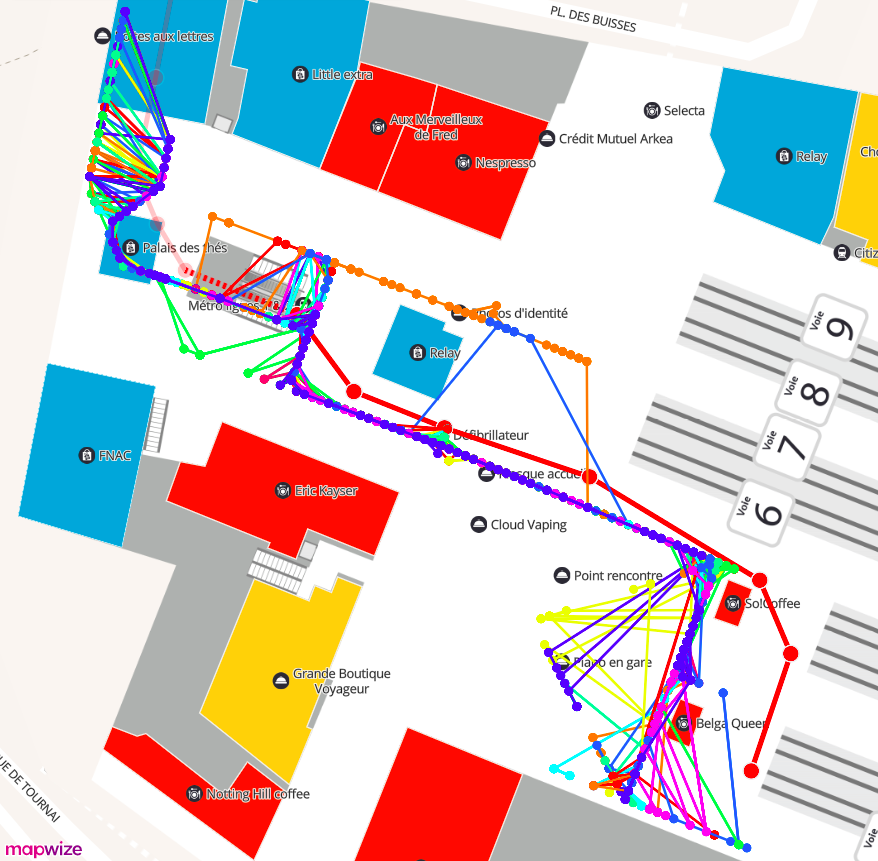
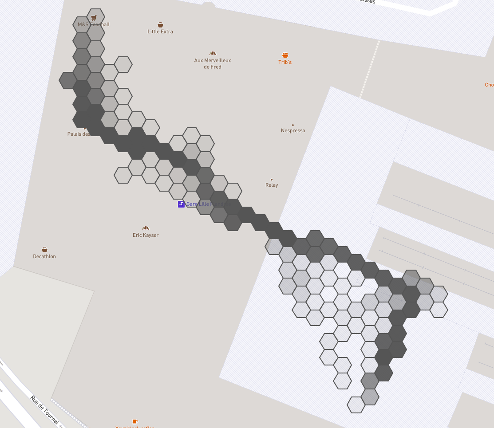
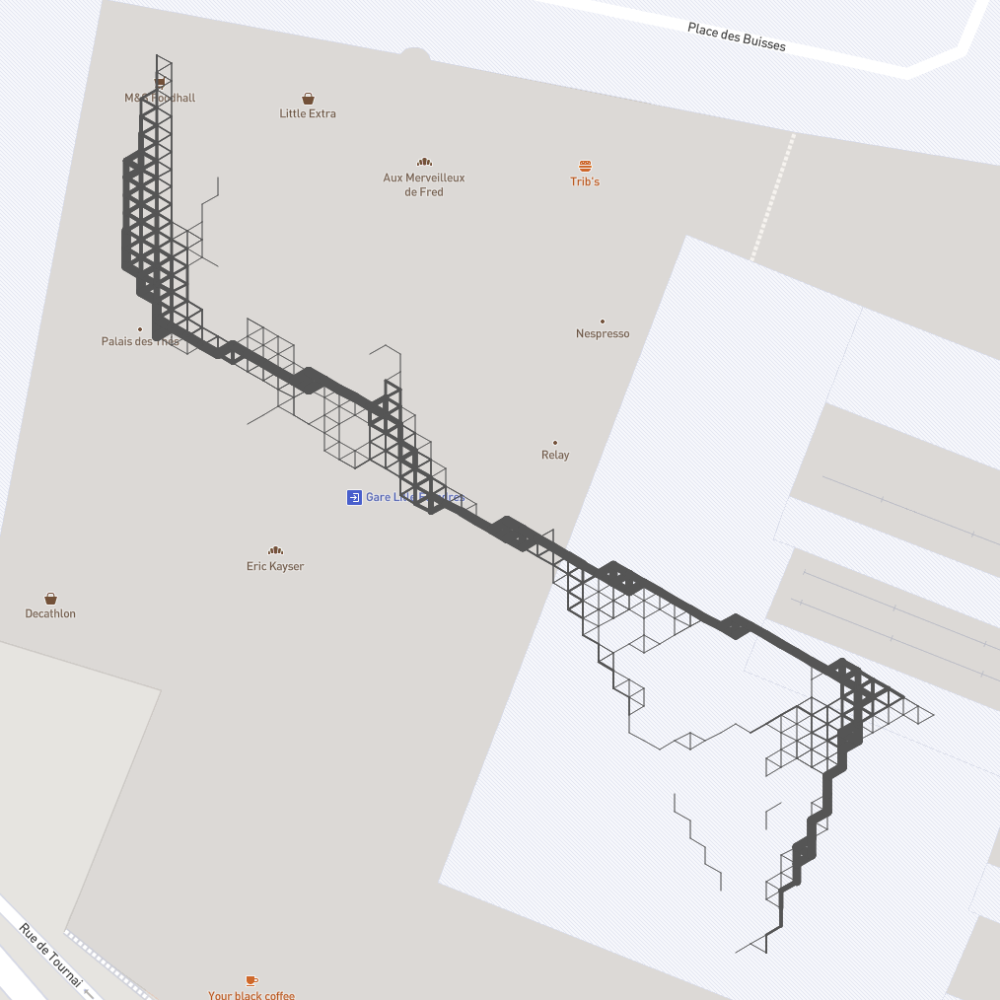
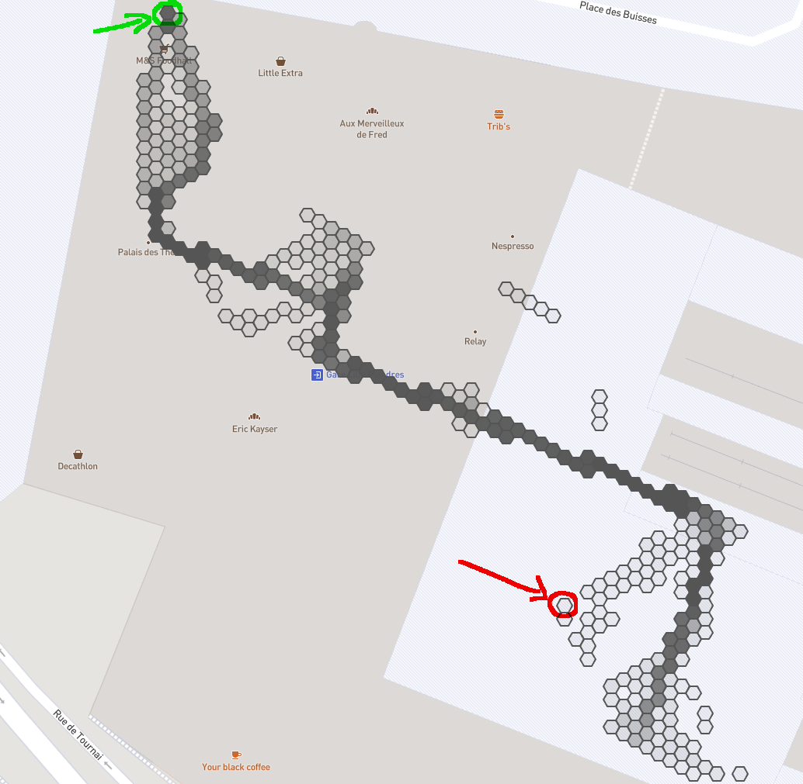

# @indoor-analytics/discrete-clustering

Clusters a bunch of paths by discretizing space with a given shape.

|  |  |
|:--:|:--:|
| *30 paths we want to cluster* | *hexagon clustering result* |

|  |  |
|:--:|:--:|
| *Corresponding graph* | *`getClusteredPath` result* |

## How to use

Add this line to `~/.npmrc` to set up the package registry:
```shell
@indoor-analytics:registry=https://npm.pkg.github.com/indoor-analytics
```

In your project, install the package:
```shell
npm i --save @indoor-analytics/discrete-clustering
```

Import methods in your code:
```javascript
import {clusterPaths, getClusteredGraph, getClusteredPath, Shape} from '@indoor-analytics/discrete-clustering';
```

## Discretization

Space can be discretized with different shapes:
* square
* triangle
* hexagon

Size of such shapes can be modified by playing with the `granularity` parameter of `clusterPaths`/`getClusteredGraph` methods.

## Errors

If you invoke methods with a high granularity, this might create cells that are isolated from the main cluster, which prevents
path extraction.

|  |
|:--:|
| *On this example, path extraction from green node to red node will fail, because there's no route linking them* |
