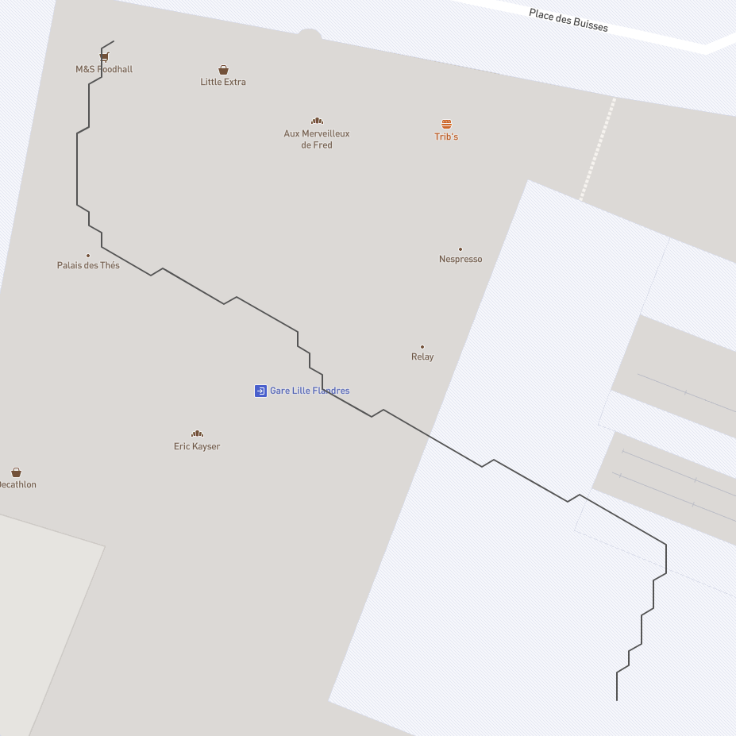

# @indoor-analytics/discrete-clustering

Clusters a bunch of paths by discretizing space with a given shape.

|  |  |
|:--:|:--:|
| *30 paths we want to cluster* | *hexagon clustering result* |

|  |  |
|:--:|:--:|
| *Corresponding graph* | *`getClusteredPathFromGraph` result* |

## How to use

Add this line to `~/.npmrc` to set up the package registry:
```shell
@indoor-analytics:registry=https://npm.pkg.github.com/indoor-analytics
```

In your project, install the package:
```shell
npm i --save @indoor-analytics/discrete-clustering
```

Import methods in your code:
```javascript
import {clusterPaths, convertPolygonsToGraph, getClusteredPathFromGraph, Shape} from '@indoor-analytics/discrete-clustering';
```

### Methods

##### Convenience method (recommended)

`getClusteredPath` calls all needed package methods to directly convert input paths into discrete-clustered output path.

```typescript
function getClusteredPath (
    paths: FeatureCollection<LineString>,
    clusteringSettings: Partial<ClusteringSettings> = {}
): Feature<LineString>
```

You can tune clustering with some options:

Name | Default value | Description
------------ | ------------- | -------------
targetDepth | `5` | Number of iterations wanted (the bigger, the smaller the discretization)
shape | `Shape.Triangle` | Shape used to discretize space

##### Manual clustering

If you need to tweak some settings or want to use a custom implementation, you can do the clustering process manually by calling
all methods yourself.

```typescript
// 1. Convert paths to cells
// 1.1 Recursive method (faster thus recommanded)
function clusterSpace (
    paths: FeatureCollection<LineString>,
    targetDepth: number,
    shouldColorCells = true,
    shape: Shape = Shape.Fit
): FeatureCollection<Polygon, {weight: number}>
// 1.2 Iterative method (slower)
function clusterPaths( paths: Feature<LineString>[], granularity: number, shape?: Shape ): FeatureCollection<Polygon, {weight: number}>;

// 2. Convert cells to graph
function convertPolygonsToGraph( cells: FeatureCollection<Polygon, {weight: number}> ): Graph;

// 3. Extract average path from graph
function getClusteredPathFromGraph( graph: Graph, start: string, end: string ): Feature<LineString>;
```

### Discretization shape

Space can be discretized with different shapes:
* square
* triangle
* hexagon

Size of such shapes can be modified by playing with the `granularity` parameter of the `clusterPaths` method.
